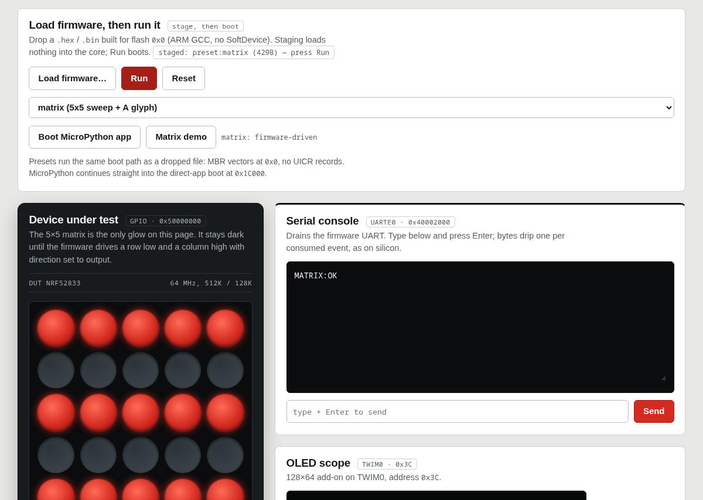

# microbit-emu — BBC micro:bit v2.2 (nRF52833) emulator in WebAssembly

Browser-based emulator for the **BBC micro:bit v2 / v2.2** (Nordic
**nRF52833**, Cortex-M4F). Run real firmware built for flash `0x0`,
drive the 5×5 LED matrix, buttons, LSM303 motion sensor, OLED/SPI
displays and serial console — plus a MicroPython REPL, MakeCode builds,
and a BLE SoftDevice SVC face — all in the page, no hardware needed.

- **Live demo:** https://danish9661.github.io/microbit-emulator/
- **npm package:** [`microbit-emu`](https://www.npmjs.com/package/microbit-emu)
  (core WASM + virtual parts + firmware images + bench page)
- **Docs in repo:** [`demo/doc.html`](demo/doc.html) (support matrices),
  [`demo/API.md`](demo/API.md) (frozen v1 driver contract),
  [`STATUS.md`](STATUS.md) (implementation status),
  [`plan.md`](plan.md) (build log)

```bash
npm install microbit-emu
```



```js
import init, * as emu from 'microbit-emu';
await init();          // loads pkg/nrf52833_periph_wasm_bg.wasm
emu.reset_state();
emu.init();            // model live: peripherals, GPIO, NVIC
const cpu = new emu.WasmCpu(0x20020000, 0x20000001, 512 * 1024, 128 * 1024);
cpu.load_firmware(bytes, 0x0);
cpu.set_deliver_irqs(true);
// pump: cpu.step(N) + emu.tick_peripherals() (+ tick_n + wake on sleep)
```

## What runs here

- **Real firmware**: MicroPython v2.1.2 boots to a 105-byte banner and a
  live `>>>` REPL (`print(1+2)` → `3`, zero faults); MakeCode
  `basic.showString` builds boot to scheduler idle (display content
  parks firmware-side, pre-scroll — documented, not a model gap).
- **21 GCC-built firmware proofs** (C, C++, BLE conformance/pairing/roles,
  matrix sweep, DMA, USB, sensors…) run natively in the Rust suite.
- **BLE**: all 67 S132 SoftDevice SVC numbers answered (GAP/GATTC/GATTS/
  L2CAP, pairing, bond store), proven over a virtual Bumble air bridge
  against two advertising peers — or loopback with zero infrastructure.
- **Board**: 5×5 matrix (DIR+OUT gated, strobe persistence), buttons,
  LSM303 accel/mag, SSD1306 OLED, ST7789 SPI display, speaker/mic/logo,
  QSPI flash, USB device, NFC pin-route, radio loopback.
- **Bench**: ~24 MIPS sustained in-browser (20×20K batch, same 20K
  quantum the firmware timing depends on).

## Verify

```bash
cargo test --manifest-path nrf52833-periph-wasm/Cargo.toml -- --test-threads=1  # 238 green
npm run test:wasm --prefix demo      # 124 checks: handshake 18/18, smoke, MPY/JS/PY/TS faces, REPL, GPIO examples
python3 tools/ble_air_bridge.py --port 18771 &
node demo/parts/ble_live_e2e.mjs ws://127.0.0.1:18771   # 42/42 over air
python3 -m http.server 8080 --directory demo &
python3 tools/browser_verify_16.py   # blinky + self-test + 16/16 probes, zero page errors
```

Rebuild the wasm after Rust changes, then serve over HTTP
(`file://` cannot load the wasm module):

```bash
wasm-pack build nrf52833-periph-wasm --target web --out-dir ../demo/pkg
cd demo && python3 -m http.server 8080
```

## Layout

- `nrf52833-periph-wasm/` — Rust core: Cortex-M4F CPU + every nRF52833
  peripheral, one instruction-count clock, loud faults by design.
- `demo/` — the published package: `pkg/` (built wasm), `parts/`
  (virtual hardware + language faces), `firmware/` (vendored images),
  `index.html` (bench), `doc.html`, `about.html`.
- `blinky/` — GCC firmware proofs (`.s`/`.c` + committed `.bin`).
- `mc/` — MakeCode project (gitignored build outputs vendored into
  `demo/firmware/`).
- `tools/` — BLE air bridge, browser verify script.

## Releasing

Releases ship from the **Publish to Registries** workflow (Actions →
Run workflow: branch, `x.y.z` version, notes). It rebuilds the wasm
from source, runs the full gate, publishes `demo/` to npmjs.org as
`microbit-emu` **and** GitHub Packages as
`@danish9661/microbit-emu`, then cuts tag `v<version>` + a GitHub
Release. Requires repo secret `NPM_TOKEN`. See
[`demo/README.md`](demo/README.md#npm-package-microbit-emu) for the
full guide.

## Scope

nRF52833 only. No STM32/UNO-R4/M0+/DAPLink targets, no SoftDevice
binary, no RF physics, no SMP crypto math (driver-side by design).
Deliberate omissions are listed with owner + reason in
[`STATUS.md`](STATUS.md#7-deliberately-out-of-scope-owner--reason--do-not-reopen-without-both)
— do not reopen without both.

License: MIT.
